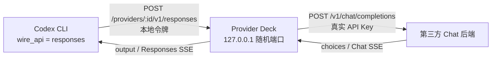

# Codex Responses 本地兼容桥

Provider Deck 的本地兼容桥用于连接只实现 `POST /v1/chat/completions` 的第三方服务。Codex CLI 不切换到 chat wire API，仍向本机发送 Responses 请求；Provider Deck 在本机完成双向翻译。

这是一层有边界的协议适配，不是完整的 Responses 服务端实现。Chat Completions 没有 Responses 的内置工具、持久会话和完整事件语义，因此部分 Agent 能力会降级。

官方协议参考：

- [Responses Create](https://developers.openai.com/api/reference/resources/responses/methods/create)
- [Chat Completions Create](https://developers.openai.com/api/reference/resources/chat/subresources/completions/methods/create)

## 根因

Responses 的请求入口是 `input`，响应主体是 `output[]`，流式响应由 `response.*` 事件组成。它还定义了 custom、内置工具、MCP 等 Responses 专属能力。

Chat Completions 的请求入口是 `messages[]`，响应主体是 `choices[]`，通用工具结构为 `tools[].type="function"`。只实现 Chat schema 的第三方网关通常使用严格枚举反序列化；收到 `type:"custom"` 或 `type:"namespace"` 时，会在调用模型前直接返回 400。

## 链路



首次启动绑定 `127.0.0.1:0`，操作系统分配端口后将端口保存到应用状态。后续启动优先复用；端口被占用时选择新端口，用户需要重新应用 Codex 配置。Provider Deck 退出后代理停止，使用桥接 Provider 的 Codex 会话也会失去连接。

每个 Provider 使用独立路径：

```text
http://127.0.0.1:<port>/providers/<provider-id>/v1
```

Codex 最终请求：

```text
POST http://127.0.0.1:<port>/providers/<provider-id>/v1/responses
```

## 自动探测

探测不依赖模型名或黑名单：

1. `GET <base>/v1/models` 获取模型列表。
2. 对选定模型请求 `POST <base>/v1/responses`，先测试 custom，再用 function 复核。
3. Responses 不可用时，请求 `POST <base>/v1/chat/completions`，携带标准 function 工具和 `tool_choice:"none"`。
4. Chat function 请求成功才标记为 `chat-proxy`；401、403、429、超时或 5xx 不会误判为兼容。
5. 配置 Codex 前注册内存路由：原始 Base URL、真实 API Key、本地令牌和网络设置。

最小 Chat 探测请求：

```json
{
  "model": "用户选择的动态模型 ID",
  "messages": [
    { "role": "user", "content": "Provider Deck compatibility probe. Reply with OK." }
  ],
  "max_tokens": 1,
  "tool_choice": "none",
  "tools": [
    {
      "type": "function",
      "function": {
        "name": "provider_deck_probe",
        "description": "Compatibility probe; never call this function.",
        "parameters": {
          "type": "object",
          "properties": {},
          "additionalProperties": false
        }
      }
    }
  ]
}
```

## 请求映射

| Responses | Chat Completions | 处理方式 |
| --- | --- | --- |
| `model` | `model` | 原样转发，不硬编码模型 |
| `instructions` | system message | 插入 `messages[]` |
| `input` message | `messages[]` | role 与内容分片转换 |
| `function_call` | assistant `tool_calls[]` | `call_id/name/arguments` 映射 |
| `function_call_output` | tool message | `tool_call_id/content` 映射 |
| function tool | function tool | 包装到 `function` 对象 |
| custom tool | function tool | 自由文本放入 `{ "input": "..." }` |
| namespace tool | 无 | 过滤并记录降级 |
| `max_output_tokens` | `max_tokens` | 字段改名 |
| reasoning `xhigh/max` | `reasoning_effort:"high"` | 避免严格网关返回未知枚举 |
| `stream:true` | `stream:true` | Chat SSE 转为 Responses SSE |

custom 工具使用带哈希的内部函数名，避免与普通 function 重名。映射只存在于当前请求内存中：

```rust
fn responses_to_chat(request: Value) -> ConvertedRequest {
    for tool in request.tools {
        match tool.type {
            "function" => keep_as_chat_function(tool),
            "custom" => wrap_as_function(tool.name, schema_for_string_field("input")),
            "namespace" => record_warning_and_drop(tool),
            _ => record_warning_and_drop(tool),
        }
    }

    ConvertedRequest {
        model: request.model,
        messages: map_input_and_tool_history(request.input),
        tools: mapped_functions,
        stream: request.stream,
        request_local_tool_map,
    }
}
```

## 响应映射

非流式：

```rust
fn chat_to_response(chat: Value, tool_map: ToolMap) -> Value {
    let mut output = vec![];

    if let Some(text) = chat.choices[0].message.content {
        output.push(response_output_text_message(text));
    }

    for call in chat.choices[0].message.tool_calls {
        output.push(match tool_map.kind(call.function.name) {
            Function => response_function_call(call),
            Custom => response_custom_tool_call(call, parse_string_field("input")),
        });
    }

    response_object(output, map_usage(chat.usage))
}
```

流式桥按 Chat chunk 累积文本和工具参数，并产生：

- `response.created`
- `response.output_item.added`
- `response.content_part.added`
- `response.output_text.delta/done`
- `response.function_call_arguments.delta/done`
- `response.custom_tool_call_input.delta/done`
- `response.output_item.done`
- `response.completed`

custom 参数必须等完整 JSON 参数可解析后，才能可靠提取 `input`，因此 custom input 的增量可能合并到流末尾。流式响应也会保存内存会话快照，使同一进程中的 `previous_response_id` 可继续使用；应用重启后旧响应 ID 不再有效。

## Codex 配置

Provider Deck 合并写入 `~/.codex/config.toml`，保留用户未知字段，不使用 `CODEX_WIRE_API=chat`：

```toml
model_provider = "provider-name"

[model_providers.provider-name]
name = "Provider Name"
base_url = "http://127.0.0.1:<port>/providers/<provider-id>/v1"
wire_api = "responses"
requires_openai_auth = false
experimental_bearer_token = "<本地代理令牌>"
```

真实上游 API Key 不写入上述 Codex Provider 配置。它保存在系统凭据库中，由代理转发上游请求时注入。

平台路径：

- Windows：`%USERPROFILE%\.codex\config.toml`
- macOS/Linux：`~/.codex/config.toml`
- 模型目录：同目录的 `provider-deck-model-catalog.json`

持久化模式合并现有 TOML、写前备份并原子替换。若桌面工具未来提供“从应用启动 Codex”的临时会话模式，应给子进程使用临时 `CODEX_HOME` 和临时合并配置；不要修改父进程全局环境变量，也不要把真实 API Key 传给 Codex。

## 未知模型上下文

模型上下文不通过名称猜测：

1. 从 `/v1/models` 的常见上下文字段读取。
2. 缺失时请求 `/v1/models/<model-id>`，读取 `context_window`、`context_length`、`max_input_tokens` 等结构化字段。
3. Codex 将结果写入 `model_context_window` 和 Provider Deck 模型目录。
4. Claude Code 的 Anthropic-compatible Provider 继续写入 `modelOverrides`；已知窗口时设置 `CLAUDE_CODE_MAX_CONTEXT_TOKENS`。
5. 服务完全不提供元数据时使用 200k 保守值，并在 UI 标记未验证；不会用高成本长文本撞限来猜窗口。

## 无法无损模拟的能力

UI 面向新手的提示建议：

> 已启用本地兼容桥。基础对话、文件编辑和标准函数工具可用；联网搜索、文件上传、MCP/namespace 工具、后台任务和部分高级推理信息可能不可用。使用 Codex 时请保持 Provider Deck 运行。

具体降级项：

- Responses 内置 web search、file search、computer use、code interpreter 等工具。
- namespace、MCP 及提供方托管工具。
- custom grammar 的服务端强制校验；代理只能通过 function schema 请求模型返回字符串。
- Responses `store`、conversation、跨进程 `previous_response_id` 和后台任务。
- 原生 reasoning item、加密 reasoning 内容、reasoning summary。
- `input_file`、托管文件 ID 及部分多模态输入。
- 完整 logprobs、服务层级、缓存细节和 Responses usage 精度。
- Chat SSE 无法提供的 Responses 事件时序；代理只能合成等价的核心事件。

## 安全与错误

- 服务器只绑定 IPv4 环回地址 `127.0.0.1`，并再次检查连接对端必须为 loopback。
- 每个 Provider 使用独立随机本地令牌；没有令牌返回 401。
- 本地令牌与上游 API Key 分离，Codex 看不到真实上游密钥。
- 不设置开放 CORS，不监听 `0.0.0.0`，不接受外部网卡连接。
- 上游非成功状态保留 HTTP 状态、响应正文、Content-Type 和 Retry-After，方便 Codex 显示真实 400/401 原因。
- 代理自身的转换错误使用独立错误类型：无效输入返回 422，网络连接失败返回 502。
- 请求体上限为 64 MiB；会话缓存仅在内存中保留有限数量，应用退出即清除。

本机其他进程如果能读取 Codex 配置，也可能读取本地令牌。因此 Codex 配置仍按敏感配置文件处理，并尽量收紧文件权限。
